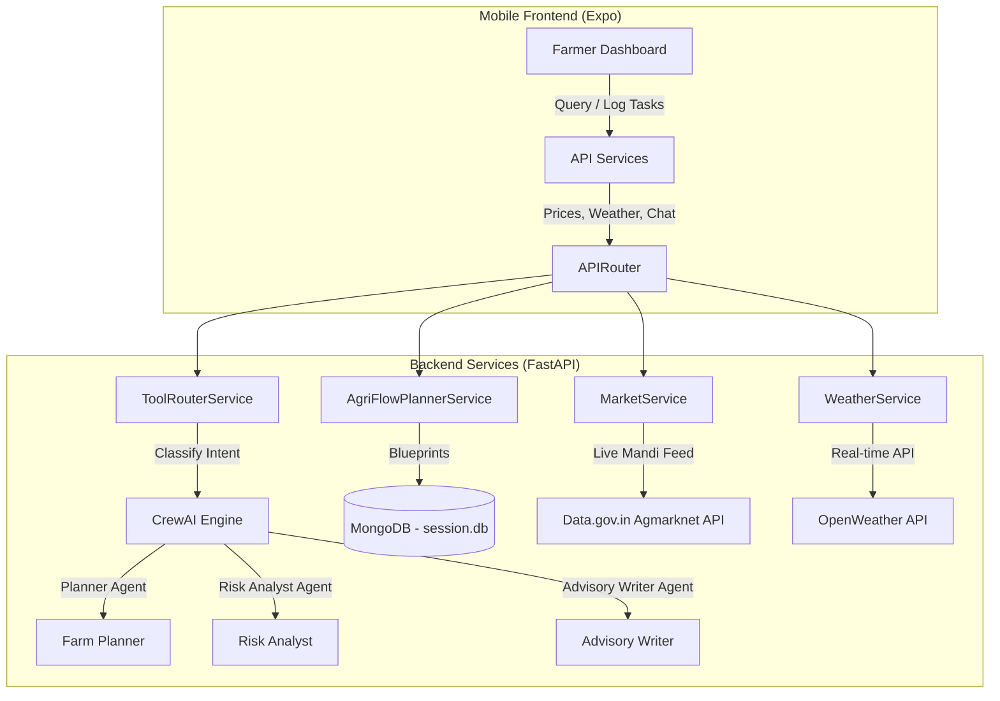

# AgriNexa 🌱

AgriNexa is an intelligent, full-stack agricultural decision-support platform designed to empower small and medium farmers. By blending **agentic AI orchestration**, **real-time weather diagnostics**, and **live market mandi price feeds**, AgriNexa provides personalized crop scheduling, predictive risk warnings, and storage advisory to maximize yield and farmer income.
---

## 🏗️ System Architecture

AgriNexa is composed of a FastAPI backend (containerized AI and service logic) and an Expo React Native mobile application for universal delivery across Android, iOS, and Web.



---

## 🧪 Core Algorithms & Decision Engines

### 1. Agentic Orchestration & Intent Classification
AgriNexa employs **CrewAI** to model multi-agent cognitive flows, falling back to a structured native LLM router if CrewAI execution fails.
* **Tool & Intent Router (`ToolRouterService`)**: Classifies query inputs into active tool pipelines (`weather`, `agent`, `rag`, `llm`) and maps tasks to six key agricultural intents: `weather`, `market`, `soil`, `pest`, `irrigation`, and `crop`.
* **Multi-Agent Collaboration**:
  * **Farm Operations Planner**: Translates location, crop, growth stage, weather, and market conditions into structured daily tasks.
  * **Agri Risk Analyst**: Cross-checks operations against chemical safety boundaries and extreme weather forecasts.
  * **Farmer Advisory Writer**: Condenses findings into plain-language, high-impact advisories (maximum 140 words).
* **Confidence Scoring Engine**: Computes reliability indexes (`low`, `medium`, `high`) based on the availability and precision of geocoding coordinates, live weather forecasts, crop growth records, and market prices.

$$\text{Confidence Score} = (S_{\text{weather}} \times 0.4) + (S_{\text{market}} \times 0.3) + (S_{\text{risk}} \times 0.3)$$

---

### 2. Crop Activity Scheduling (AgriFlow Planner)
The AgriFlow engine templates operations into stages, creating customized checklists for farmers.
* **Stage-Gate Blueprints**: Automatically schedules activities using crop-specific blueprints (`rice`, `wheat`, `maize`, `cotton`) mapped to crop cycles:
  * **Land Preparation**: Basal fertilizer and leveling.
  * **Sowing**: Seed treatment and nursery checks.
  * **Vegetative**: Top-dressing splits and weed schedules.
  * **Flowering**: Water maintenance and pollinator protection.
  * **Harvest**: Drying and grain moisture checks.
* **Dynamic Real-Time Alignment**: If a farmer logs a field observation indicating early flowering, the service adjusts the starting date of subsequent stages, marks prior tasks as completed/skipped, and recalculates the progress percentage.

---

### 3. Soil-Crop Suitability Matcher
Recommends the top 3 optimal crops for a given land parcel using a weight-based scoring system:

| Factor | Soil Type / Condition | Score Adjustment | Target Crop Impact |
| :--- | :--- | :--- | :--- |
| **Texture** | Clay / Alluvial | $+0.20$ / $+0.10$ | Rice, Wheat (favors water retention) |
| **Texture** | Loam | $+0.15$ / $+0.10$ | Maize, Groundnut |
| **Texture** | Sandy | $+0.20$ / $+0.15$ | Millet, Groundnut |
| **Acidity** | pH < 5.8 | $+0.10$ / $+0.05$ | Millet, Groundnut |
| **Alkalinity** | pH > 7.8 | $+0.10$ / $+0.05$ | Cotton, Wheat |
| **Humidity** | Humidity > 75% | $+0.15$ | Rice |
| **Location** | Region: Delta / Cauvery / Tamil Nadu | $+0.10$ / $+0.05$ | Rice, Cotton |

---

### 4. Weather-Driven Pest & Disease Risk Models
Pest risk levels are determined programmatically by checking weather values against established microclimatic triggers:
* **Fungal Disease Risk**:
  $$\text{Fungal Score} = (15^{\circ}\text{C} \le T \le 25^{\circ}\text{C} \to 40) + (\text{Humidity} > 80\% \to 30) + (\text{Rainfall} > 10\text{mm} \to 30)$$
* **Bacterial Disease Risk**:
  $$\text{Bacterial Score} = (\text{Humidity} > 75\% \to 50) + (\text{Rainfall} > 5\text{mm} \to 50)$$
* **Insect Activity Risk**:
  $$\text{Insect Score} = (22^{\circ}\text{C} \le T \le 32^{\circ}\text{C} \to 50) + (\text{Wind} < 10\text{ km/h} \to 50)$$
* **Chemical Spray Feasibility**:
  * **Not Feasible**: Rain $> 2\text{mm}$ (runs risk of pesticide wash-off) or Wind $> 25\text{ km/h}$ (chemical drift).
  * **Optimal**: Wind between $5$ and $15\text{ km/h}$ under clear skies.

---

### 5. Mandi Market Price Extraction & Storage Decision Engine
* **Agmarknet API Integration**: Fetches prices from the Data.gov.in database using the API endpoint.
* **Hierarchical Search Relaxation**:
  1. Search by exact `State` + `District` + `Commodity`.
  2. Fallback to `State` + `Market Name` (handles cases where users confuse market and district names).
  3. Fallback to `State` + `Commodity` average.
  4. Fallback to commodity average nationwide.
  5. Distance/Fuzzy matching via Python `SequenceMatcher` to associate user coordinate inputs with closest available mandi records.
* **Financial Storage Advisory**:
  Calculates whether storing grains in local warehouses is financially viable by checking the volatility index ($V$) against storage costs.
  * **Breakeven Calculation**:
    $$\text{Breakeven Monthly Price Growth (\%)} = \frac{\text{Storage Cost / Unit}}{\text{Current Market Price}} \times 100$$
  * Recommend **Store** if forecasted price appreciation over 3–6 months exceeds storage costs and breaks even; otherwise, recommend immediate **Sell**.

---

## 📁 Repository Structure

```
AgriNexa/
├── backend/
│   ├── app/
│   │   ├── main.py                # FastAPI entrypoint & middleware setup
│   │   ├── api/v1/endpoints/      # Endpoint controllers (agri_flow, chat, market, weather)
│   │   ├── core/                  # Configuration settings & environment variables
│   │   ├── db/                    # MongoDB connection session
│   │   ├── models/                # Database models & schemas
│   │   ├── agents/                # CrewAI agent roles & tasks (crew.py, planner.py)
│   │   ├── services/              # Core logic services (weather, market, RAG, recommendations)
│   │   └── rag/                   # Document loader, chunker, and retriever setup
│   └── requirements.txt           # Backend python packages
│
├── frontend/
│   ├── app/
│   │   ├── (auth)/                # Signup, login, & authentication routes
│   │   ├── (tabs)/                # Main dashboard, agriflow calendar, scan, market prices
│   │   └── _layout.tsx            # Navigation drawer / structure
│   ├── components/                # Reusable UI widgets (cards, weather status, loaders)
│   ├── services/                  # Mobile HTTP clients (weather client, market client)
│   └── package.json               # Expo & React Native configurations
│
└── README.md                      # Project documentation
```

---

## 🚀 Getting Started

### Prerequisites
* Python 3.10+
* Node.js v18+ & npm
* MongoDB instance (local or Atlas)

---

### Running the Backend

1. Navigate to the backend directory:
   ```bash
   cd backend
   ```
2. Set up a virtual environment:
   ```bash
   python -m venv venv
   source ./venv/bin/activate
   pip install -r requirements.txt
   ```
3. Create your `.env` file from the config options and populate:
   ```env
   OPENAI_API_KEY=your_openai_key
   DATA_GOV_API_KEY=your_data_gov_india_key
   OPENWEATHER_API_KEY=your_openweather_key
   MONGODB_URI=mongodb://localhost:27017/agrinexa
   ```
4. Run the development server:
   ```bash
   uvicorn app.main:app --host 0.0.0.0 --port 8000 --reload
   ```
   * Access API docs at: `http://localhost:8000/api/v1/docs`

---

### Running the Frontend (Expo app)

1. Navigate to the frontend directory:
   ```bash
   cd frontend
   ```
2. Install Node dependencies:
   ```bash
   npm install
   ```
3. Set your backend URL in `.env`:
   ```env
   EXPO_PUBLIC_API_URL=http://localhost:8000/api/v1
   ```
4. Start the bundler:
   ```bash
   npx expo start
   ```
5. Press `a` for Android, `i` for iOS simulator, or scan the QR code using the Expo Go application on a mobile device.
